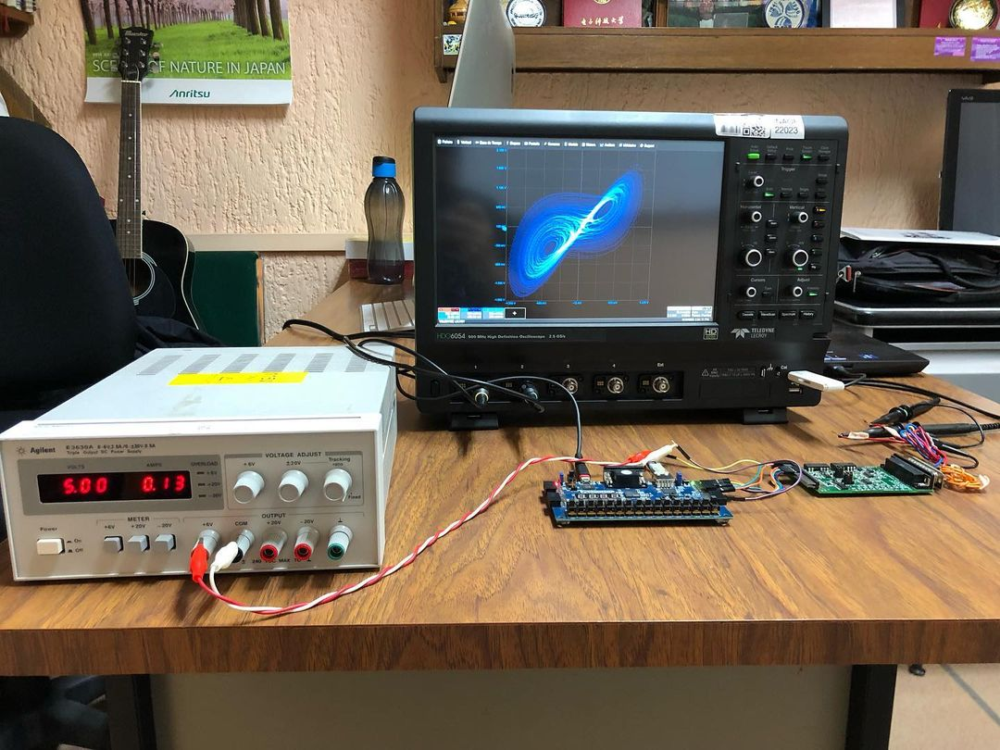

# About me

Hola, mi nombre es Ciro Bermudez, soy ingeniero electrónico desde el año 2019 y quiero que conozcas un poco más de mi. 

Después de terminar mis estudios universitarios hice una maestría en instrumentación electrónica enfocándome principalmente en el diseño de circuitos digitales usando lenguajes de descripción de hardware (Verilog y VHDL). Durante ese tiempo aprendí mucho sobre arquitectura de computadoras, algoritmos y programación en C/C++ y Python. Mi trabajo consistía principalmente en implementar todo tipo de sistemas digitales a medida para resolver algún problema. Desde hacer funcionar un ADC o un DAC implementando los protocolos de comunicación SPI o I2C, transferir los datos obtenidos a una computadora utilizando el protocolo UART hasta implementar sistemas más complejos como filtros digitales FIR/IIR o unidades CORDIC.

Uno de los trabajos de los que me siento más orgulloso es la implementación en FPGA de un oscilador caótico utilizando aritmética de punto fijo, no tanto por su complejidad o relevancia, sino más bien por todo lo que aprendí realizándolo. Cada uno de los códigos que escribí para automatizar el proceso, cada simulación, cada optimización y cada modificación que hicieron que el sistema pasara desde el papel hasta una implementación en el mundo real.

<figure markdown>
  { width="500" }
  <figcaption> 2 de julio de 2002</figcaption>
</figure>

Comencé esta página para compartir algunos de los proyectos que he realizado, que más me han gustado y que se le serán de gran ayuda a alguien. Espero puedas sacarle provecho a las cosas que publique aqui.

Actualmente me encuentro estudiando el doctorado en diseño de circuitos integrados, en unos años veremos donde nos lleva eso ...

 

 

 

 

 
