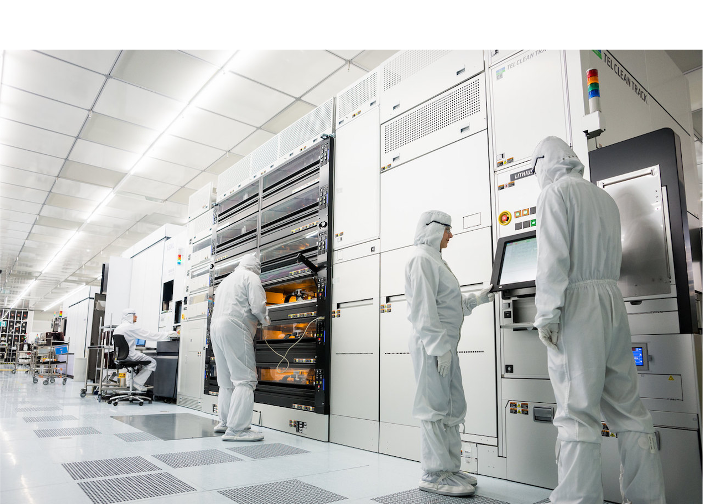

---
hide:
  - navigation
  - toc
---

# MPW and Small Volume Production services

{ align=left width=600}

 

CERN offers to organize MPW runs to help keep the cost of fabricating 
prototypes and of small-volume production low by enabling multiple participants
to share production overhead costs.

CERN has established working relationships with [EUROPRACTICE IC Service]() 
and [Globalfoundries]() for acquiring cost effective access to advanced 
technology foundry services.

CERN offers to organize the fabrication of low-volume production quantities
for mature ASIC designs.

[Contact CERN Foundry Services](#){ .md-button .md-button--primary}
